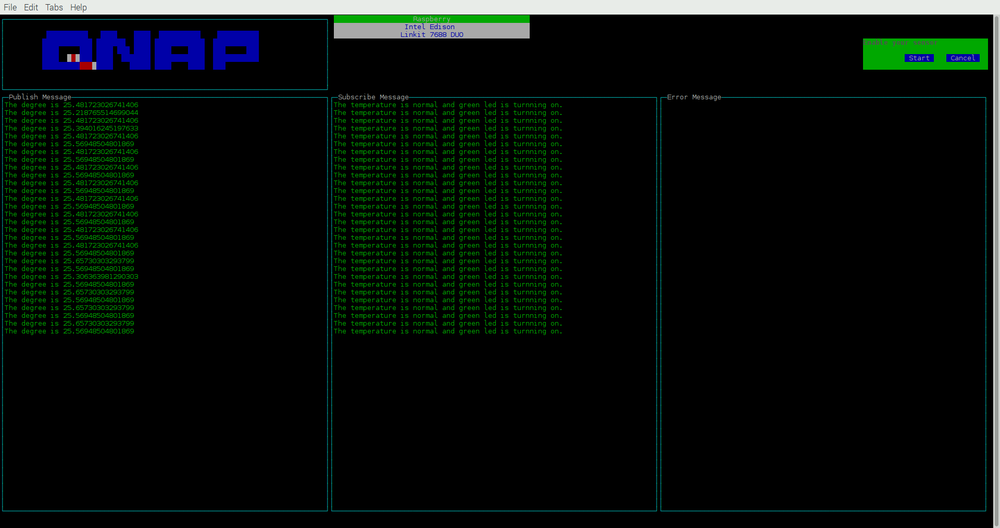

Run a simple Node.js sample on device
===
---

# Table of Contents

-   [Introduction](#Introduction)
-   [Step 1: Prerequisites](#Prerequisites)
-   [Step 2: Prepare your Device](#PrepareDevice)
-   [Step 3: Build and Run the Sample](#Build)

<a name="Introduction"></a>
# Introduction

**About this document**

This document describes how to build and run the **mqtt_hello_world_sample.js** OR **mqtt_temperaturesensor_and_LED_simple_sample.js** as Node.js sample application. This multi-step process includes:
-   Configuring Your QNAP QIoT container
-   Registering your IoT device
-   Build and deploy QNAP QIoT device SDKs on device

<a name="Prerequisites"></a>
# Step 1: Prerequisites

You should have the following items ready before beginning the process:
-   Computer with Git client installed and access to the
    [qnap-qiot-sdks](https://github.com/qnap-dev/qnap-qiot-sdks) GitHub public repository.
-   [Prepare your development environment](https://github.com/qnap-dev/qnap-qiot-sdks/doc/set_outnode-dev-env-setup.md).

<a name="PrepareDevice"></a>
# Step 2: Prepare your Device
## Take Raspberry Pi Series for example
-   Make sure desktop is ready as per instructions given on [Prepare your development environment][lnk-setup-devbox].

In order to run the Node.js sample properly, before your first try, please, go inside your [examples/raspberry](../../node/device/examples/raspberry) application folder and type
```bash
$ npm install node-grovepi mqtt
```

# Step 3: Build and Run the sample

MQTT Example

- Get the following sample files from https://github.com/qnap-dev/qnap-qiot-sdks/tree/master/node/device/examples/raspberry
    - **mqtt_hello_world_sample.js**
    - **mqtt_temperaturesensor_and_LED_simple_sample.js**

- Place the files in the folder of your choice on the target machine/device

- **mqtt_hello_world_sample.js** is showing how it is easy to create a mqtt request, please, take a glance at the snippet and feel.

- Open the file **mqtt_temperaturesensor_and_LED_simple_sample.js** in a text editor.

- Locate the following code in the file:

    ```
    var client = mqtt.connect('mqtt://[your_ip_or_dns]:[your_port]');
    ```

- Give a proper pub/sub topic name that you are interested:

    ```
    var publishTopic = '[your_topic]';
    var SubscribeTopic = '[your_topic]';
    ```
- Open a new shell or Node.js command prompt and navigate to the folder where you placed the sample files. Run the sample application using the following commands:

    ```
    node mqtt_temperaturesensor_and_LED_simple_sample.js
    ```

- The sample application will send messages to your QIoT container, and please make a good use of mqtt client [MQTT.fx](http://mqttfx.jfx4ee.org/index.php/download) utility will display the messages as your QIoT container receives them.

# See more
- Sometimes, for better experiences, GUI is more attractive than just coding. Of course, we provide an experimental dashboard to monitor and manage your devices with no code required.

**[Device dashboard example](../../node/device/examples/mqtt_temperaturesensor_and_LED_dash_sample.js)**



# Experimenting with various transport protocols
The same sample can be used to test MQTT, HTTP and CoAP. In order to change the transport, uncomment whichever you want to evaluate in the `require` calls on top of the sample code and pass it to the call to Client.fromConnectionString() when creating the client.


[lnk-setup-devbox]: node-dev-env-setup.md
