### Scenario1: AWS GG device --> AWS GG Core --> QIoT --> QuAI --> AWS GG Core Lambda --> AWS Cloud --> S3 bucket

#### How to setup?

- Prepare AWS Greengrass
- Setup AWS GG Device
- Setup QIoT
- Setup QuAI
- Setup AWS cloud S3 bucket & Rules
- Start the demo
- Verify the demo

#### ___Step1:___ Prepare AWS Greengrass
1.  Install AWS Greengrass App in QNAP NAS from App center

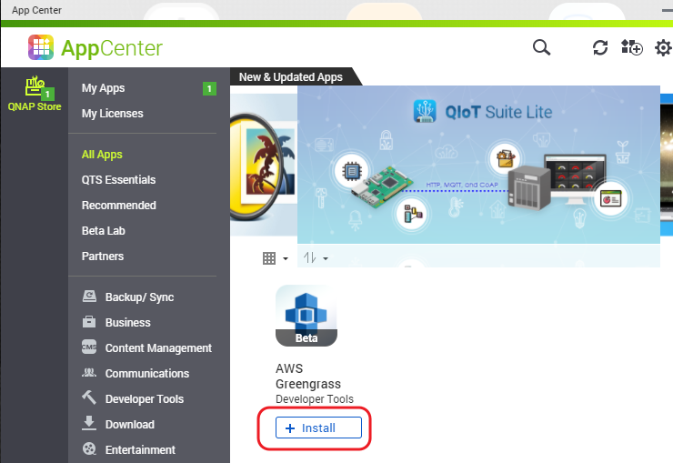

2.  Setup your AWS Greengrass Group & Core in QNAP AWS Greengrass App. Please refer this link for more details https://qiot.qnap.com/blog/en/2018/01/17/setup-greengrass-qnap-nas/
3.  Create SendGGImageToQIoT & QIoTIntegration Node.js Lambda functions inside AWS Greengrass Lambda function  as shown in the below image and update it's configuration setting's Memeory limit and timeout. Please find Demo Lambda source codes inside <> folder

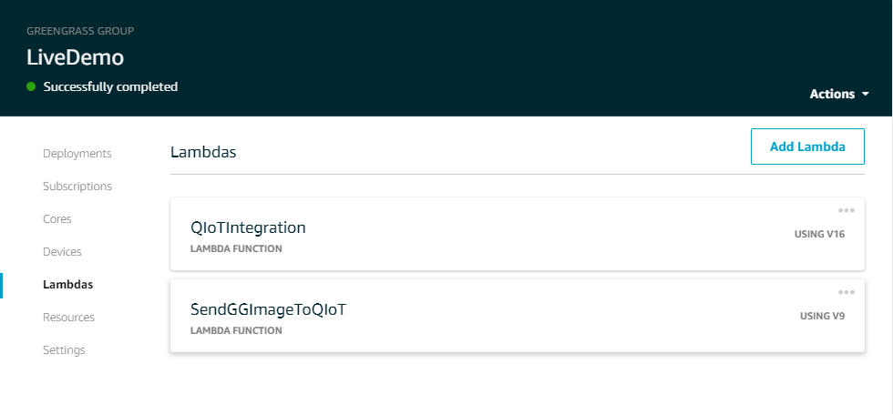

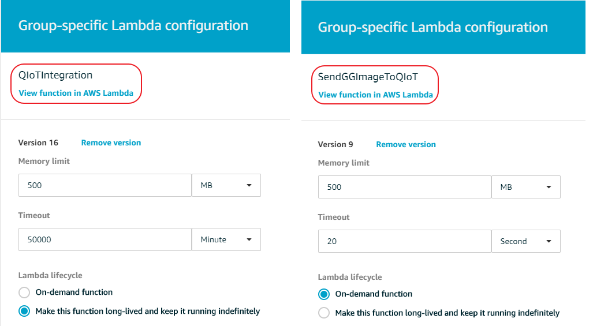

4.  Create a new device inside Greengrass Group Devices section as shown in the below image

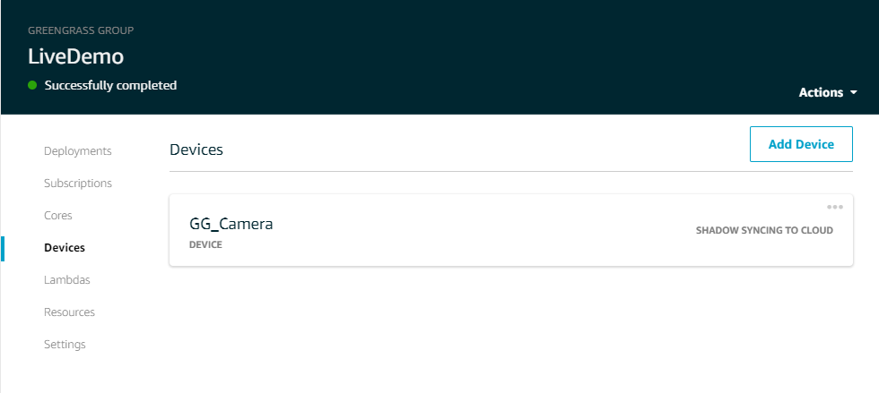

5.  Prepare below 3 subscriptions list
  - Greengrass Device to SendGGImageToQIoT:9 Lambda for Image Prediction
  - QIoTIntegration Lambda function to IoT Cloud for upload predicted image to S3 Bucket
  - Greengrass Device to QIoTIntegration:16 Lmabda for republish QIoT predcited message to  AWS Greengrass then to AWS Cloud.

  Please refer the following image for these 3 subscriptions list source, destination and topic details
  
  

6. Deploy the Greengrass Group.

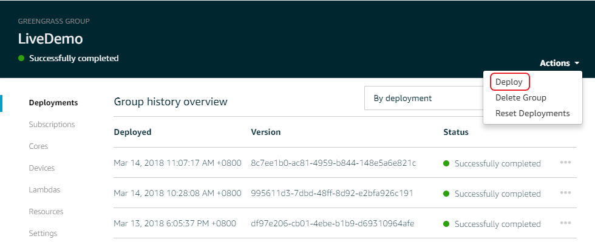  

#### ___Step2:___ Setup AWS GG Device
Deploy the "Capture image" source code from <> folder to Raspberry Pi
  
#### ___Step3:___ Setup QIoT  
1. Import <> folder LiveDemo.json to QIoT
2. If you are using old QIoT version then please follow the below manual instruction
+ Create 2 things as below

  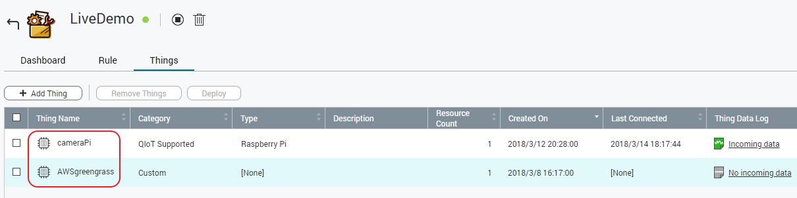  
  
+ Import <> to rules using Rules tab --> Import --> Clipboard option. After import you can see the following 2 rules flow

  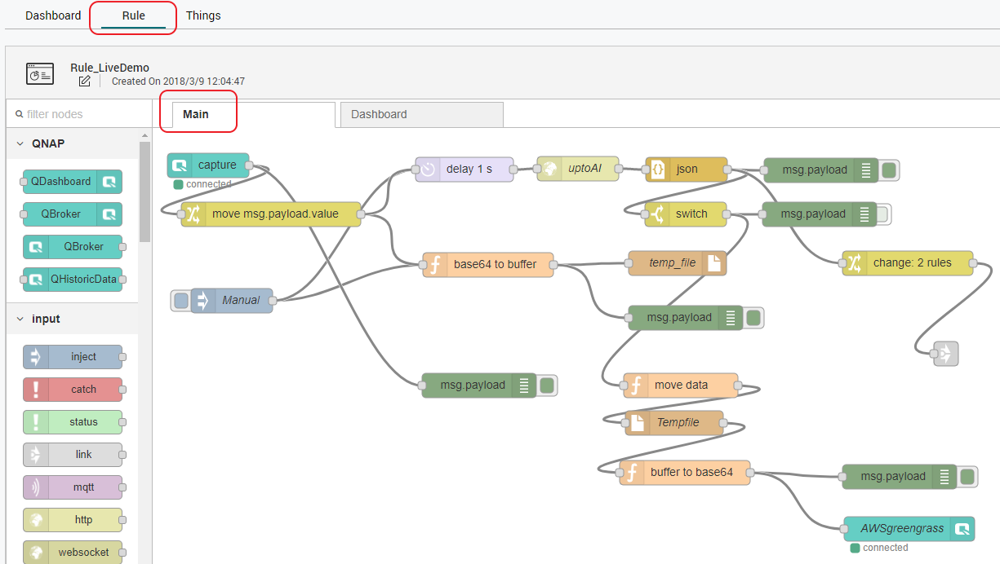  
  
    
  
+ Verify your dashboard

  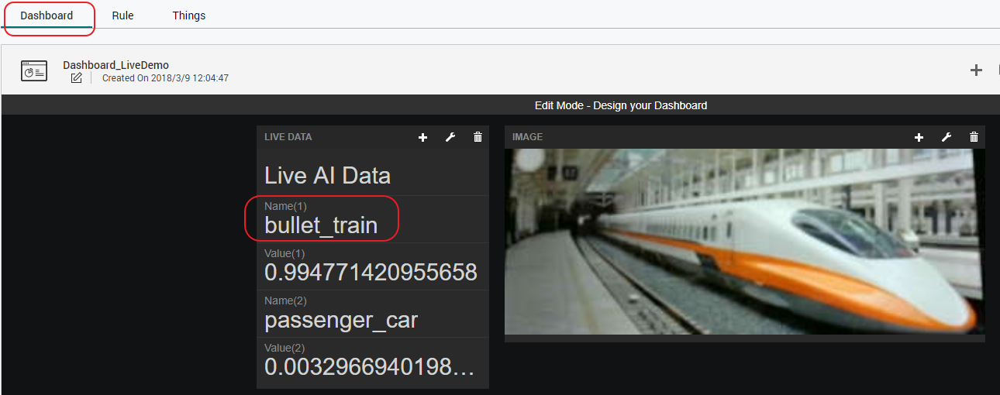  

#### ___Step4:___ Setup QuAI
Please follow this link <> to setup QuAI container in QNAP NAS container station app.

#### ___Step5:___ Setup AWS cloud S3 bucket & Rules
1. Create MoveImageToS3 Node.js Lambda function in AWS Lambda service
2. Create a new S3 bucket "qiotquaiggdemo" in AWS S3 service
3. Create a Act(rule) in AWS IoT to upload Image to S3 bucket using Rule's action "Invoke a Lambda function passing the message data"

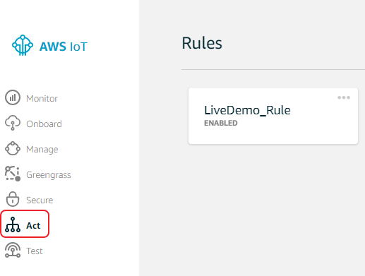

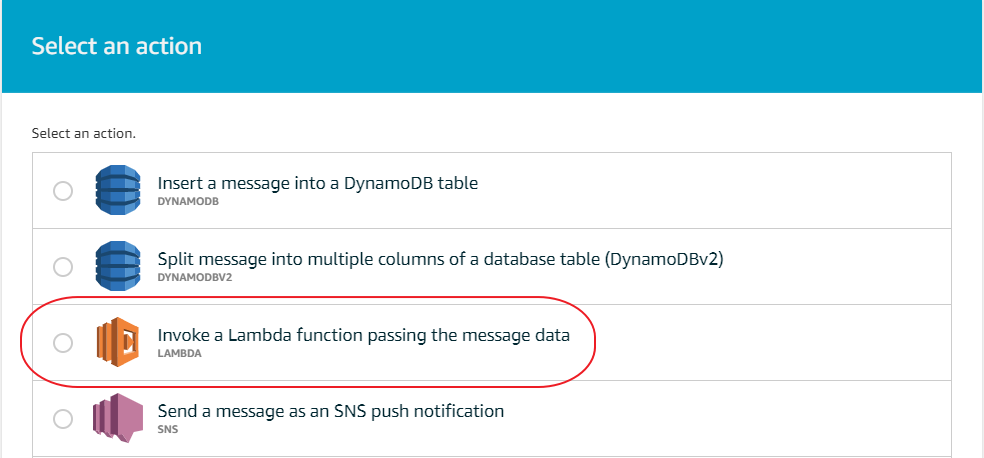

3. Declare MoveImageToS3 in the function name drop down and update the changes

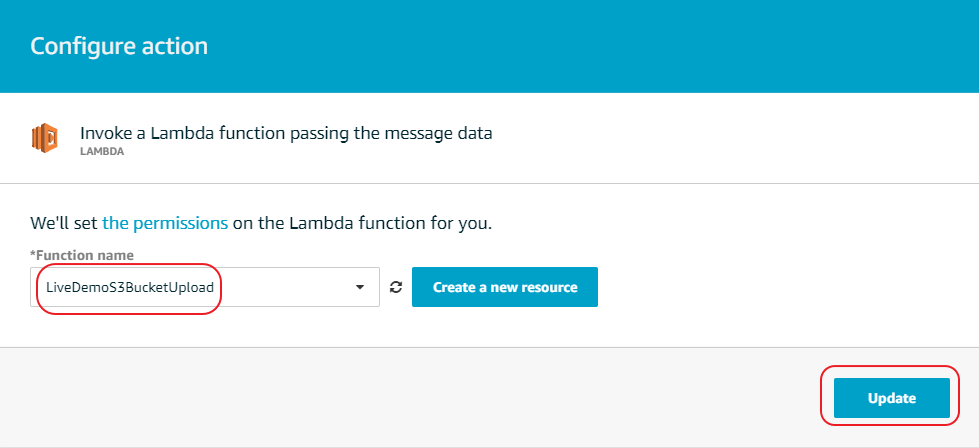

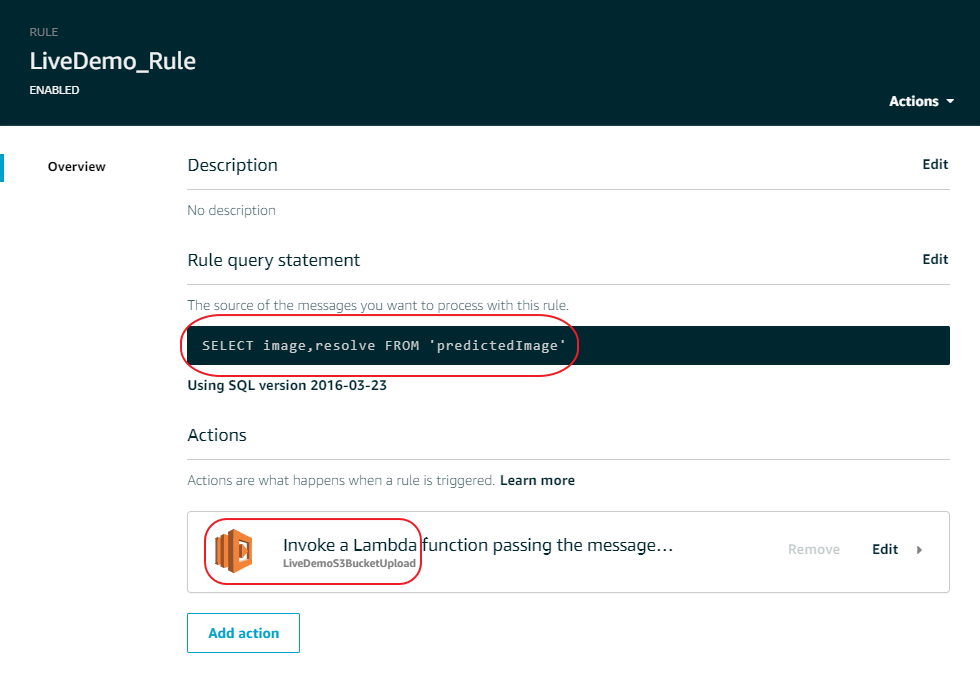

#### ___Step6:___ Start the demo
Setup the camera in Raspberry Pi device and start the program by executing the following command

    python send_image_AWSGG.py -e <host>.iot.<region>.amazonaws.com -r root.ca.pem -c <GG_Camrea_Cert_pem_file> -k GG_Camrea_Cert_private_key_file -n GG_Camera -m publish -t "cameraImage"