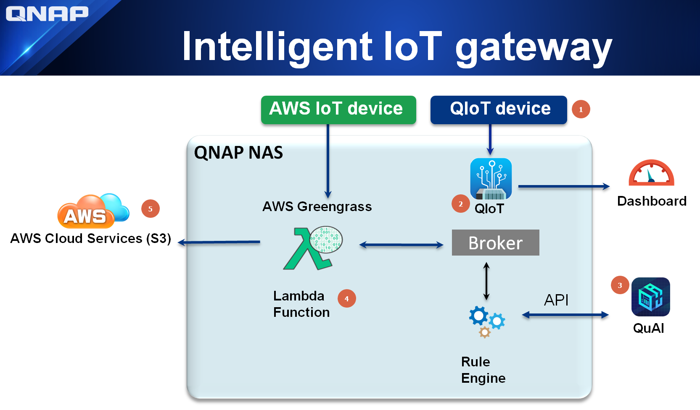

# Tutorial to setup Image prediction using AWS Greengrass(GG) + QIoT + QuAI using Raspberry Pi Camera

## Example Scenarios to predict captured image from Raspberry Pi camera

### Scenario 1:
- AWS GG device --> AWS GG Core --> QIoT --> QuAI --> AWS GG Core Lambda --> AWS Cloud --> S3 bucket

Please refer this section [Greengrass_device_QIoT_QuAI](https://github.com/qnap-dev/qnap-qiot-sdks/tree/master/projects/AWSGreengrass-Integration-Scenarios/Greengrass_device_QIoT_QuAI/ "Greengrass_device_QIoT_QuAI") to setup this scenario 1

### Scenario 2:
- QIoT device --> QIoT --> QuAI --> AWS GG Core Lambda --> AWS Cloud --> S3 bucket

This scenario steps are same as scenario1 exclude the Raspberry Pi program execution. Please refer this section [QIoT_device_QuAI_Greengrass](https://github.com/qnap-dev/qnap-qiot-sdks/tree/master/projects/AWSGreengrass-Integration-Scenarios/QIoT_device_QuAI_Greengrass/ "QIoT_device_QuAI_Greengrass")  to setup the device.
